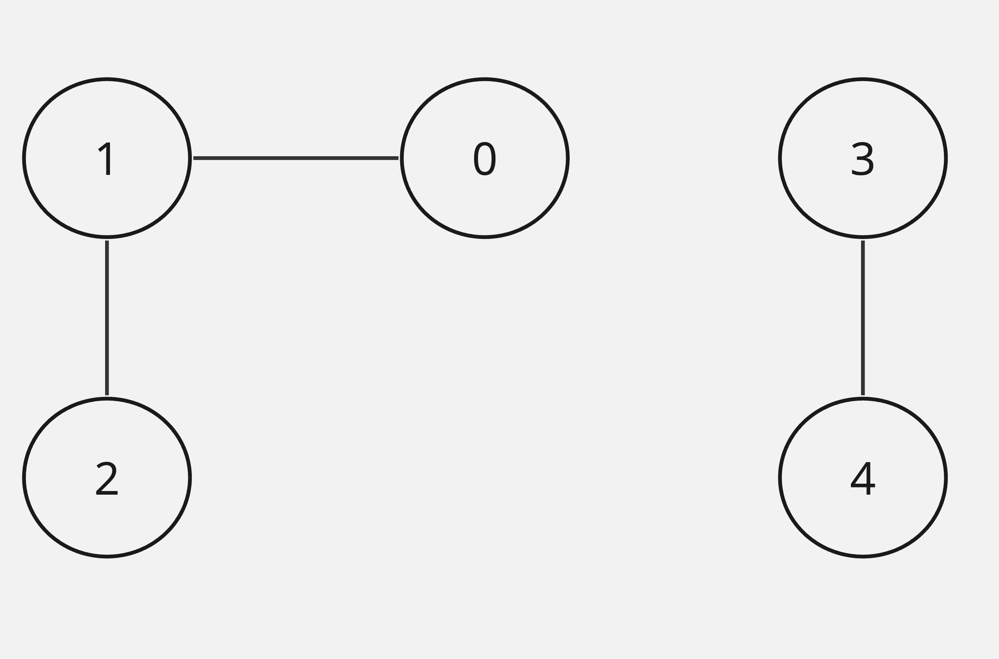
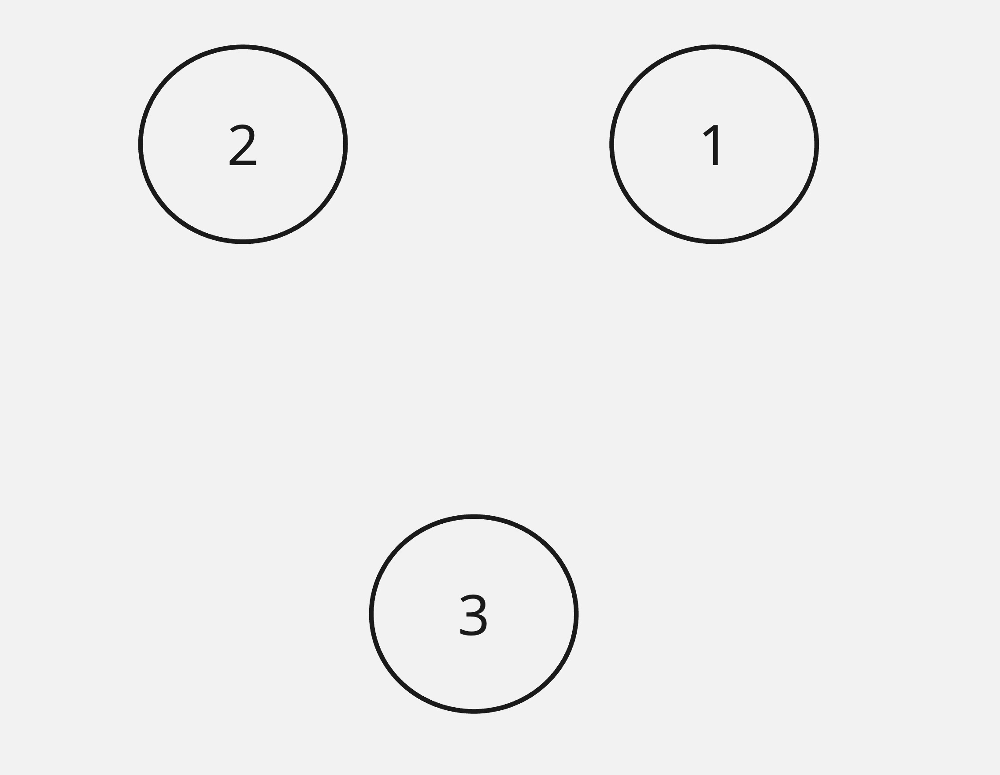

### Question:
Given n nodes labeled from 0 to n - 1 and a list of undirected edges (each edge is a pair of nodes), write a function to find the number of connected components in an undirected graph.

#### Example:

 

Input: `n = 5`, `edges = [[0,1], [1, 2], [3, 4]]`

Output: `2`

#### Example:

 

Input: `n = 3`, `edges = []`

Output: `3`

